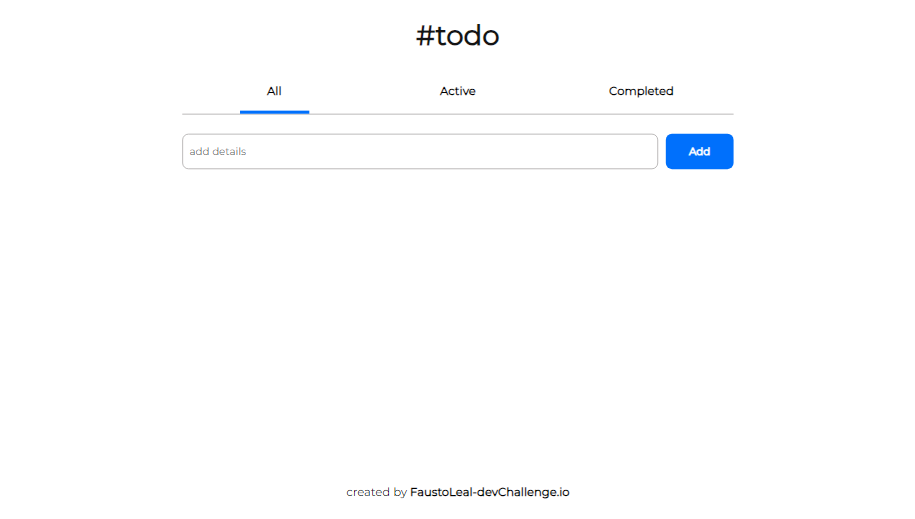

# ToDo

Proyecto _React + Vite_ basada en un desafío de [https://devchallenges.io/](https://devchallenges.io/) que consiste en realizar un app web de una lista de tareas.



#### Tecnologías y herramientas utilizadas

- HTML
- CSS
- React.js
- react-router-dom
- MaterialUI
- Vite.js

#### Componentes

| Componente | Funcionalidad/Contenido                                        |
| ---------- | -------------------------------------------------------------- |
| Active     | Vista donde se listan las tareas activas                       |
| All        | Vista donde se listan todas las tareas                         |
| Completed  | Vista donde se listan solo las tareas completadas              |
| Footer     | Pie de página                                                  |
| Form       | Input de tipo form donde se escriben las tareas                |
| Item       | Todas la tareas que tengan un input checkbox                   |
| Item       | Las tareas que completas que tenga un icono de tacho de basura |
| TodoList   | Donde se encuentra el Router de react-router                   |

#### Instalación

Clonar reposirorio:

```bash
git clone https://github.com/faustoleal/toDo-react
```

Instalar dependencias:

```bash
npm install
```

Correr proyecto de forma local:

```bash
git clone https://github.com/faustoleal/toDo-react
```

### Más información

Puedes econtrar el proyecto desplegado [aquí](https://faustoleal.github.io/toDo-react/)
